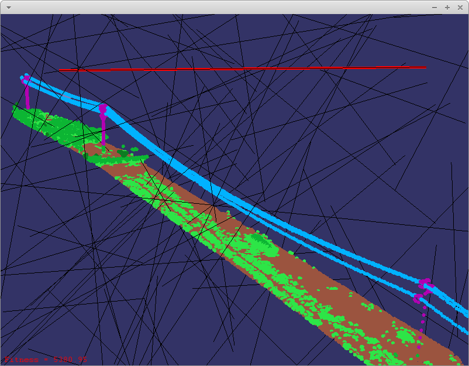

# crsGA: C++ Genetic Algorithm library

crsGA is a C++ template library for developing genetic algorithms, plus some other utilities (Logger and Threading).

---

**NOTE**

The library was designed to be easy to use, but knowledge of Genetic Algorithm concepts is required. It might not be well suited for high performance and it will always depend on how you define your data structures.

---

The library allows to implement each of the concepts of a Genetic Algorithm, for instance the following example shows how to implement the **OneMax** genetic algorithm.

First we define what is a `Gen`:

```cpp
/**
 * @brief Represents the smallest piece of information.
 * 
 * A bit of the bitstring of the onemax algorithm
 * 
 */
class Gen : public crsGA::IGen
{
  public:
    // Gen data (1 bit)
    uint8_t bit = 0;

  public:
    Gen() = default;
    virtual ~Gen() = default;
    // How to mutate this gen 
    virtual void mutate(const crsGA::UserData *) override
    {
        bit = 1 - bit;
    }
    // Random creation, used for initialization
    virtual void random(const crsGA::UserData *) override
    {
        if(computeProbability() >= 50.0)
            bit = 1 - bit;
    }
    // Just some friendly way of serializing the information
    friend std::ostream &operator<<(std::ostream &os, const Gen &gen)
    {
        os << static_cast<int>(gen.bit);
        return os;
    }
};
```

Then we need to define a `Chromosome`, which is composed of a set of `Gens`. In order to know which `Chromosome` is the best one (the fittest one), we also need to define the `ComputeFitnessPolicy`:

```cpp
/**
 * @brief Defines how to compute the fitness of a chromosome
 * 
 * We return -sum(bitstring), since the algorithm tries to 
 * minimize the fitness value
 */
class ComputeFitness : public crsGA::ComputeFitnessPolicy<Gen>
{
  public:
    virtual float computeFitness(const std::vector<Gen> &genes,
                                 const crsGA::UserData *) const override
    {
        float fitness = 0.0f;
        for (const auto &g : genes)
        {
            fitness += g.bit;
        }
        return -fitness;
    }
};
```

And the `Chromosome` definition:

```cpp
// Chromosome definition, internally a std::vector<Gen>
using Chromosome = crsGA::Chromosome<Gen, ComputeFitness>;
```

The next step is to define the `Population` and how it will be initialized:

```cpp
/**
 * @brief Defines the initialization policy for the Population
 * 
 * @tparam ChromosomeT Type of Chromosome
 */
template <typename ChromosomeT>
class PopulationInitializationPolicy
{
  public:
    void initialize(std::vector<ChromosomeT> &chromosomes, const crsGA::UserData *data) const
    {
        for (auto &c : chromosomes)
        {
            for(auto &g: c.getGenes())
            {
                g.random(data);
            }
        }
    }
};

// Population definition
using Population = crsGA::Population<Chromosome, PopulationInitializationPolicy<Chromosome>>;
```

Finally we need to define the `GeneticAlgorithm` that will put all together:

```cpp
using OneMaxGA = crsGA::GeneticAlgorithm<Gen, Chromosome, Population>;
```

For running the genetic algorithm needs a few more steps:

```cpp
int main(int, char **)
{
    // Number of bits of the onemax bitstring
    auto numGenes = 20u;
    auto populationSize = 100u;
    // the fittest one, will be all genes to 1 (111111 ....11)
    auto fitnessGoal = -static_cast<float>(numGenes);
    // mutation rate
    float mutationFactor = 0.5f;
    OneMaxGA ga(populationSize, numGenes, fitnessGoal);
    ga.setMutationFactor(mutationFactor);
    ga.reset();
    // run up to 10 seconds
    ga.run(10.0);
    return 0;
}
```

This was an example using most of the default functionality. The API allows also to define the `CrossoverPolicy`, the `SelectionPolicy` and the `ReplacementPolicy`, although a default implementation has been provided. See `GeneticAlgorithm.hpp` and `Common.hpp` headers for more details.

## Applications

The code also provides a couple of more advanced applications, which allows to visualize the genetic algorithm progress and results in 3D using [OpenSceneGraph](https://github.com/openscenegraph/OpenSceneGraph).

The applications try to automatic detect the power lines using Genetic and Simulated Annealing algorithms on point cloud data:



## Build

For building, it uses [**CMake**](https://cmake.org/) and optionally [**Conan**](https://conan.io/) if you want to build the applications.

```bash
mkdir build
cd build
cmake .. -DCMAKE_BUILD_TYPE=Release
make -j 8
 # Optional, you may want to change the install with
 # -DCMAKE_INSTALL_PREFIX in cmake command
make install
```

For running the **OneMax** example:

```bash
cd build/bin
./onemax
```

For building the applications and download thirtparty dependencies with **Conan**, make sure you have installed [**Conan**](https://conan.io/) on your system.

---
**Note**

A `Pipfile` for **pipenv** file is provided with the source code, so you can install **Conan** using it if you are familiar with it.

---

```bash
mkdir build
cd build
cmake .. -DCMAKE_BUILD_TYPE=Release -DCRSGA_BUILD_APPLICATIONS=ON
make -j 8
```

For running the GA application:

```bash
cd build/bin
./ga --txt ../../data/electric_lines_and_ground.xyz --numGenes 6 --mutationFactor 20 --show
```
